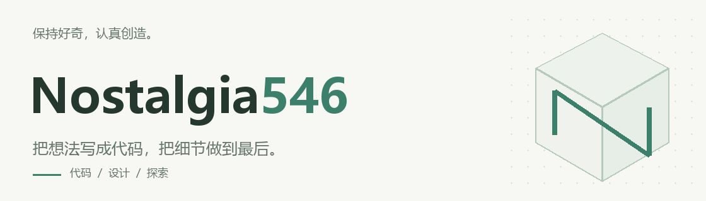
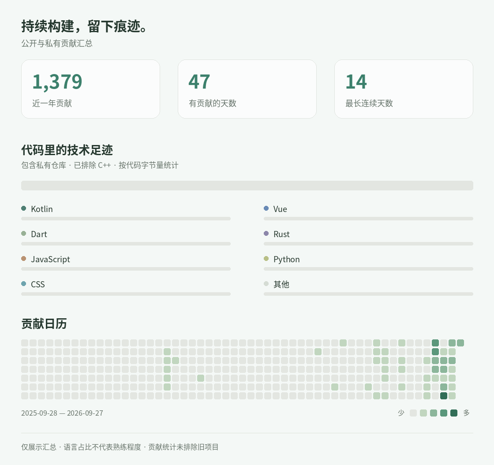

  

喜欢简洁的界面、可控的系统，以及值得反复打磨的小东西。

**界面与交互 · AI 与自动化 · 系统与部署**

`Vue` · `Rust` · `Kotlin` · `Dart` · `Python` · `TypeScript`

 

  <picture>
    <source media="(prefers-reduced-motion: reduce)" srcset="assets/activity.png" />
    
  </picture>

关于这些数据

贡献日历取自 GitHub 最近一年的贡献统计；语言占比汇总已授权的自有非 Fork 仓库，包含私有仓库。仓库名、代码和提交内容不在此展示。

语言统计已排除 C++，其余语言按剩余代码字节量重新计算比例，不代表熟练程度或本人代码贡献量。贡献日历仍包含旧项目。图中日期为当前统计覆盖范围。

