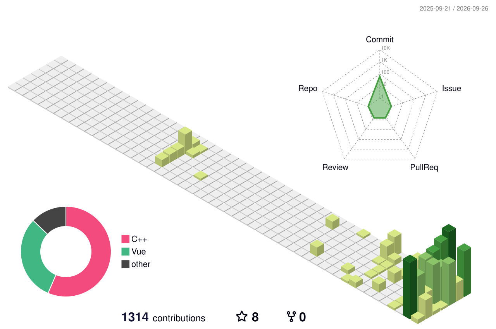
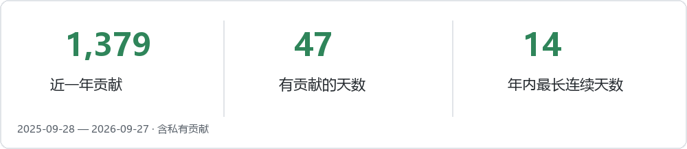
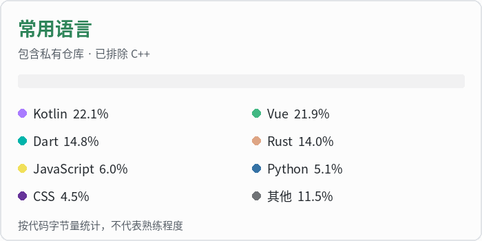
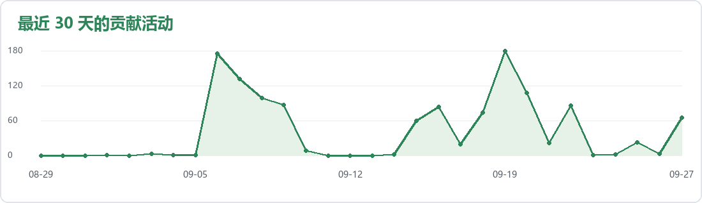

# Nostalgia546

 

专注于构建高效、可扩展的 Web 应用及工具，致力于提升用户体验与开发效率。

---

## 技术栈

  
  
  
  
  
  
   
  
  
  
  
  
   
  
  
  
  
  

---

## GitHub 数据

包含已授权的私有仓库汇总，不公开项目详情。语言统计排除 C++，按剩余代码字节量计算；贡献仍包含旧项目。

  

  

  

  

---

## 开源项目

### [Antigravity-Booster](https://github.com/Nostalgia546/Antigravity-Booster)
**Antigravity 辅助工具** | Vue3 + Tauri 2.0
- 解决 Antigravity 不遵循系统代理的问题
- 支持多账号管理
- 提供余量查询功能
- 记录历史使用情况

### [ChatTrail](https://github.com/Nostalgia546/ChatTrail)
**AI 整合客户端** | Vue3 + Node.js
- 集成上下文感知聊天引擎
- 支持 AI 文本生成图像功能
- 致力于提供一体化的 AI 交互体验

### [2FAuth-app](https://github.com/Nostalgia546/2FAuth-app)
**2FAuth 桌面客户端** | Vue3 + Node.js + Tauri 2.0
- 基于 Token 和服务器地址的安全登录
- 通过 API 方式查看和管理 2FAuth 账户信息
